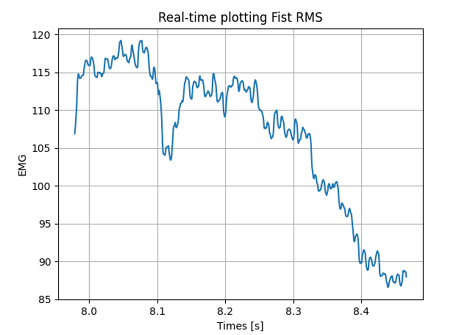
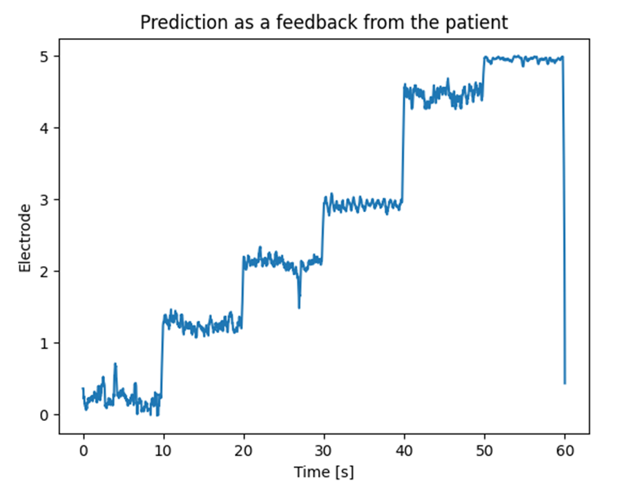

# Machine Learning and Neural Interface

This repository contains the code for visualizing real-time EMG data from fingers and classify activated finger based on
EMG.

## Plot EMG data

The EMG streams the data in chunks whose size depends on the sampling frequency and the
streaming refresh rate of the device. The sampling frequency is 2048 Hz, and the refresh rate is 8 Hz.  
Then, the size of one chunk is calculated from the sampling frequency and refresh rate.

Each chunk contains information from 408 channels, where the first 384 are the EMG signals, the next 16 are the AUX
input to the EMG.
And then one last channel that sends a ramp to check the streaming quality. This ramp channel sends zeros because we
recreated the 408 channels from prerecorded data used in our experiments. For the test data set, the 400th channel
contains the labelling information use for calculating the accuracy of the model, while the last 7 channels (401 - 408)
consist of zeros and are not used.

## Classification

In this repository, XGBoost is employed and a hyperparameter tuning is performed to find the best parameters for the
model. The best parameters are then used to train the model and test the accuracy of the model. 

